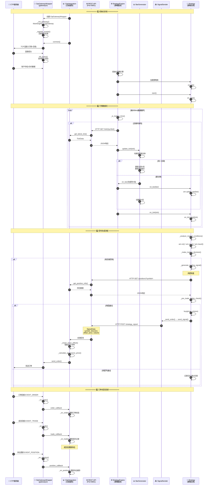

# ARBIG 数据流时序图 - 从CTP到策略执行

```mermaid
sequenceDiagram
    autonumber
    participant CTP as 📡 CTP服务器
    participant GW as 🔌 CtpGatewayWrapper<br/>(gateways/)
    participant CI as 📊 CtpIntegration<br/>(交易服务)
    participant API as 🌐 REST API<br/>(Port 8001)
    participant SE as ⚙️ StrategyEngine<br/>(策略服务)
    participant BG as 📊 BarGenerator
    participant SS as 📤 SignalSender
    participant ST as 🧪 Strategy<br/>(策略实例)

    Note over CTP,ST: ========== 1️⃣ 初始化阶段 ==========
    
    CI->>GW: 创建 CtpGatewayWrapper
    GW->>GW: _init_gateway()<br/>MainEngine + CtpGateway
    GW->>GW: _register_events()<br/>注册事件处理
    CI->>GW: connect()
    GW->>CTP: TCP连接 (行情+交易)
    CTP-->>GW: 连接成功
    GW->>GW: init_query()<br/>查询账户/持仓
    CTP-->>GW: 账户/持仓/合约数据
    
    SE->>SE: 初始化策略引擎
    SE->>ST: 加载策略类
    ST->>ST: on_init()
    SE->>ST: start()
    ST->>ST: on_start()

    Note over CTP,ST: ========== 2️⃣ 行情数据流 ==========
    
    loop 每500ms数据循环
        SE->>SE: _is_trading_time()
        alt 交易时间内
            SE->>API: HTTP GET /tick/{symbol}
            API->>CI: get_latest_tick()
            CI-->>API: TickData
            API-->>SE: JSON响应
            
            SE->>BG: update_tick(tick)
            BG->>BG: 判断是否新分钟
            
            alt 同一分钟
                BG->>BG: 更新当前K线<br/>更新高低收价
            else 新分钟
                BG->>SE: on_bar(完成的K线)
                SE->>ST: on_bar(bar)
                ST->>ST: am.update_bar(bar)
                BG->>BG: 创建新K线
            end
            
            SE->>ST: on_tick(tick)
            ST->>ST: on_tick_impl(tick)
        end
    end

    Note over CTP,ST: ========== 3️⃣ 信号生成流程 ==========
    
    ST->>ST: _analyze_market_conditions()
    ST->>ST: am.rsi() / am.ema() / am.macd()
    ST->>ST: _make_trading_decision()
    
    alt 有交易信号
        ST->>ST: _generate_trading_signal()
        
        Note over ST: 风控检查
        ST->>API: HTTP GET /positions?symbol=
        API->>CI: get_position_info()
        CI-->>API: 持仓数据
        API-->>ST: JSON响应
        
        ST->>ST: _pre_trade_safety_check()
        
        alt 风控通过
            ST->>ST: buy(price, volume)
            ST->>SS: _send_order() → send_signal()
            SS->>API: HTTP POST /strategy_signal
            Note over API: SignalData:<br/>symbol, direction,<br/>offset, price, volume
            
            API->>CI: 处理信号
            CI->>CI: _smart_close_offset()<br/>智能平今/平昨
            CI->>CI: _calculate_aggressive_price()
            CI->>GW: send_order()
            GW->>CTP: 发送订单
        else 风控不通过
            ST->>ST: 记录日志,跳过交易
        end
    end

    Note over CTP,ST: ========== 4️⃣ 订单/成交回调 ==========
    
    CTP-->>GW: 订单回报 EVENT_ORDER
    GW->>GW: _on_order()
    GW->>CI: order_callback
    CI->>CI: _on_order() 更新订单状态
    
    CTP-->>GW: 成交回报 EVENT_TRADE
    GW->>GW: _on_trade()
    GW->>CI: trade_callback
    CI->>CI: _on_trade() 更新成交记录
    
    Note over CI: 成交后更新持仓
    CTP-->>GW: 持仓更新 EVENT_POSITION
    GW->>GW: _on_position()
    GW->>CI: position_callback
    CI->>CI: _on_position() 更新持仓缓存
```

