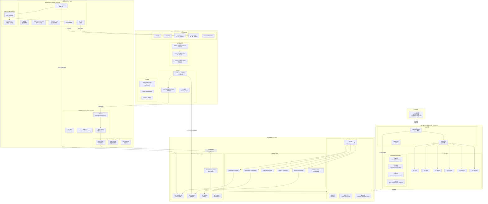

# ARBIG 完整系统架构 - CTP网关 → 交易服务 → 策略服务 → 策略

```mermaid
flowchart TB
    subgraph External["🌐 外部系统"]
        CTPServer["📡 CTP服务器<br/>SimNow/实盘<br/>行情服务器 + 交易服务器"]
    end

    subgraph Gateway["🔌 CTP网关层 (gateways/ctp_gateway.py)"]
        direction TB
        
        subgraph VnpyEngine["vnpy引擎"]
            EventEngine["EventEngine<br/>事件引擎"]
            MainEngine["MainEngine<br/>主引擎"]
            VnpyCtpGateway["VnpyCtpGateway<br/>vnpy_ctp网关"]
        end
        
        subgraph GatewayWrapper["CtpGatewayWrapper 封装"]
            ConnectMgr["连接管理<br/>connect()/disconnect()"]
            Subscribe["订阅管理<br/>subscribe()/unsubscribe()"]
            OrderMgr["订单管理<br/>send_order()/cancel_order()"]
            QueryMgr["查询管理<br/>query_account()/query_position()"]
        end
        
        subgraph EventHandlers["事件处理器"]
            OnTick["_on_tick()"]
            OnOrder["_on_order()"]
            OnTrade["_on_trade()"]
            OnAccount["_on_account()"]
            OnPosition["_on_position()"]
            OnContract["_on_contract()"]
        end
        
        EventEngine --> OnTick
        EventEngine --> OnOrder
        EventEngine --> OnTrade
        EventEngine --> OnAccount
        EventEngine --> OnPosition
        EventEngine --> OnContract
    end

    subgraph TradingService["📊 交易服务 (Port 8001)"]
        direction TB
        
        subgraph CtpIntegration["CtpIntegration (ctp_integration.py)"]
            CtpInit["initialize()<br/>connect()"]
            CtpEvents["事件回调<br/>_on_tick/_on_order等"]
            SmartOffset["智能平仓<br/>_smart_close_offset()"]
            AggressivePrice["激进价格<br/>_calculate_aggressive_price()"]
        end
        
        subgraph DataCache["数据缓存 (字典)"]
            Ticks["ticks{symbol: TickData}"]
            Positions["positions{key: PositionData}"]
            Orders["orders{id: OrderData}"]
            Trades["trades{id: TradeData}"]
            Account["account: AccountData"]
            Contracts["contracts{symbol: ContractData}"]
        end
        
        subgraph RestAPI["REST API (real_trading.py)"]
            TickAPI["GET /tick/{symbol}<br/>获取实时行情"]
            PositionAPI["GET /positions<br/>获取持仓"]
            AccountAPI["GET /account<br/>获取账户"]
            SignalAPI["POST /strategy_signal<br/>接收策略信号"]
            StatusAPI["GET /status<br/>获取连接状态"]
        end
        
        CtpEvents --> Ticks
        CtpEvents --> Positions
        CtpEvents --> Orders
        CtpEvents --> Trades
        CtpEvents --> Account
        
        Ticks --> TickAPI
        Positions --> PositionAPI
        Account --> AccountAPI
        SignalAPI --> CtpIntegration
    end

    subgraph StrategyService["🧠 策略服务 (Port 8002)"]
        direction TB
        
        subgraph Engine["StrategyEngine (strategy_engine.py)"]
            EngineInit["初始化<br/>加载策略类"]
            DataLoop["_data_processing_loop()<br/>每秒轮询行情"]
            TradingTime["_is_trading_time()<br/>交易时间判断"]
            FetchData["_fetch_market_data()<br/>获取行情"]
            DistributeTick["分发tick给策略"]
            OnBarCallback["_on_bar()<br/>K线回调"]
        end
        
        subgraph DataTools["数据工具 (data_tools.py)"]
            BarGenerator["BarGenerator<br/>Tick→1分钟K线"]
            ArrayManager["ArrayManager<br/>K线数组+技术指标"]
        end
        
        subgraph SignalSender["SignalSender (signal_sender.py)"]
            SendSignal["send_signal()<br/>发送交易信号"]
            HealthCheck["health_check()<br/>检查交易服务"]
            GetPositions["get_positions()<br/>获取持仓"]
        end
        
        subgraph Template["ARBIGCtaTemplate (cta_template.py)"]
            Lifecycle["生命周期<br/>start()/stop()"]
            TradeMethods["交易方法<br/>buy()/sell()/short()/cover()"]
            Callbacks["回调方法<br/>on_tick()/on_bar()/on_trade()"]
            SendOrder["_send_order()<br/>创建SignalData"]
        end
        
        FetchData --> BarGenerator
        BarGenerator --> OnBarCallback
        BarGenerator --> ArrayManager
        TradeMethods --> SendOrder
        SendOrder --> SendSignal
    end

    subgraph Strategy["🧪 SystemIntegrationTestStrategy"]
        direction TB
        
        subgraph StrategyCallbacks["生命周期回调"]
            SOnInit["on_init()"]
            SOnStart["on_start()"]
            SOnTick["on_tick(tick)<br/>on_tick_impl(tick)"]
            SOnBar["on_bar(bar)<br/>on_bar_impl(bar)"]
            SOnTrade["on_trade_impl(trade)"]
        end
        
        subgraph SignalLogic["信号生成逻辑"]
            Analyze["_analyze_market_conditions()<br/>市场分析"]
            Decision["_make_trading_decision()<br/>多因子决策"]
            Generate["_generate_trading_signal()<br/>生成信号"]
        end
        
        subgraph RiskControl["风控模块"]
            QueryPos["_query_real_position()<br/>HTTP查询持仓"]
            SafetyCheck["_pre_trade_safety_check()<br/>风控检查"]
            PosCache["持仓缓存<br/>cached_position"]
        end
        
        subgraph StrategyVars["策略变量"]
            Params["参数: signal_interval<br/>trade_volume, max_position"]
            AM["self.am: ArrayManager"]
            PriceHistory["last_price_history[]"]
        end
        
        SOnTick --> Analyze
        Analyze --> Decision
        Decision --> Generate
        Generate --> QueryPos
        QueryPos --> SafetyCheck
    end

    %% 连接关系
    CTPServer <-->|"TCP连接<br/>行情+交易"| VnpyCtpGateway
    VnpyCtpGateway --> EventEngine
    
    Gateway -.->|"封装使用"| CtpIntegration
    
    FetchData -->|"① HTTP GET /tick"| TickAPI
    DistributeTick -->|"② on_tick()"| SOnTick
    OnBarCallback -->|"③ on_bar()"| SOnBar
    
    QueryPos -->|"④ HTTP GET /positions"| PositionAPI
    
    SafetyCheck -->|"⑤ buy()/sell()"| TradeMethods
    SendSignal -->|"⑥ HTTP POST /strategy_signal"| SignalAPI
    
    CtpIntegration -->|"⑦ send_order()"| VnpyCtpGateway
```

