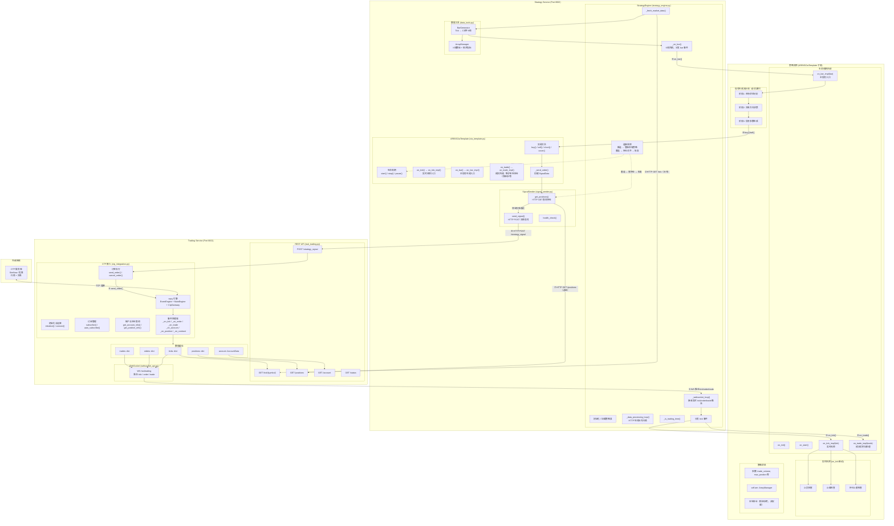

# ARBIG 完整系统架构 - Trading Service → Strategy Service → Strategy Instance

## 架构决策摘要

| 决策 | 结论 |
| --- | --- |
| 服务划分 | 三层保持（Trading / Strategy / Web Admin），行情暂不独立拆分 |
| Trading Service 断开 | 立即暂停所有策略，重连后持仓对齐再恢复 |
| 信号传递 | Strategy → Trading，HTTP POST，策略与数据源解耦 |
| 信号分层 | 分析 → 决策 → 生成，策略代码必须遵守 |
| 触发入口 | on_bar() 处理信号生成，on_tick() 处理实时风控 |
| 持仓查询 | 每次下单前 HTTP 查询真实持仓，正确性优先 |

## 架构图

## 关键数据流说明

### 正常路径

1. CTP 服务器通过 TCP 向 vnpy 引擎推送行情和成交
2. Trading Service 的事件处理器更新内部数据缓存
3. Trading Service 通过 WebSocket（①）向 Strategy Service 推送实时数据
4. Strategy Engine 同时通过 HTTP 轮询（②）补充行情，覆盖 WebSocket 断连恢复期
5. tick 事件分发到策略的 `on_tick_impl()`（③），驱动实时风控
6. BarGenerator 合成 K 线后，通过 `on_bar_impl()`（④）触发策略信号生成
7. 成交回报通过 `on_trade_impl()`（⑤）回调策略，父类同时更新本地持仓快速参考
8. 策略信号生成后，调用 `buy()/sell()` 等交易方法（⑥）
9. 下单前，必须通过 HTTP 查询 Trading Service 的真实持仓（⑦），校验通过后才发送信号
10. 信号通过 HTTP POST 发送到 Trading Service（⑧）
11. Trading Service 通过 vnpy 引擎执行订单（⑨）

### 异常路径：Trading Service 断连

1. Strategy Engine 的连接监控检测到 WebSocket 断开
2. 立即暂停所有运行中的策略（冻结信号生成和下单，保留策略状态）
3. 持续尝试 WebSocket 重连
4. 重连成功后，先通过 HTTP 查询 Trading Service 的真实持仓
5. 将远程持仓与本地状态对齐（远程为准）
6. 对齐完成后，恢复策略运行

### 持仓数据的两层设计

- **权威来源**：Trading Service 的 `GET /positions`，反映 CTP 侧真实持仓
- **快速参考**：父类 `on_trade()` 维护的本地 `pos` / `long_pos` / `short_pos`
- **使用规则**：日常风控可参考本地状态；下单前必须查远程；发现不一致时以远程为准并记录告警

---

最后更新：2026-03-13
文档版本：v4.0
