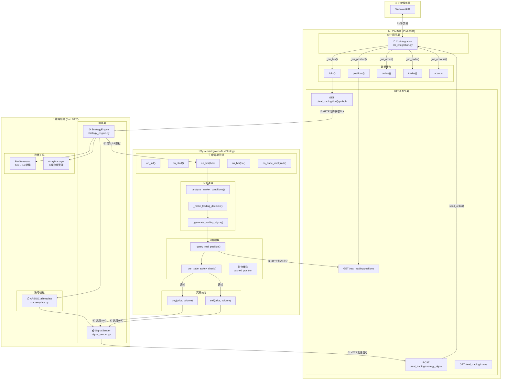

# ARBIG 系统架构图

## 1. 核心架构 - 交易服务 ↔ 策略服务 ↔ 策略

```mermaid
flowchart TB
    subgraph CTP["📡 CTP服务器"]
        CTPServer["SimNow/实盘"]
    end

    subgraph TradingService["📊 交易服务 (Port 8001)"]
        direction TB
        
        subgraph CtpLayer["CTP网关层"]
            CtpIntegration["🔌 CtpIntegration<br/>ctp_integration.py"]
        end
        
        subgraph DataCache["数据缓存"]
            Ticks["ticks{}"]
            Positions["positions{}"]
            Orders["orders{}"]
            Trades["trades{}"]
            Account["account"]
        end
        
        subgraph TradingAPI["REST API 层"]
            TickAPI["GET /real_trading/tick/{symbol}"]
            PositionAPI["GET /real_trading/positions"]
            SignalAPI["POST /real_trading/strategy_signal"]
            StatusAPI["GET /real_trading/status"]
        end
        
        CtpIntegration -->|"_on_tick()"| Ticks
        CtpIntegration -->|"_on_position()"| Positions
        CtpIntegration -->|"_on_order()"| Orders
        CtpIntegration -->|"_on_trade()"| Trades
        CtpIntegration -->|"_on_account()"| Account
        
        Ticks --> TickAPI
        Positions --> PositionAPI
        SignalAPI -->|"send_order()"| CtpIntegration
    end

    subgraph StrategyService["🧠 策略服务 (Port 8002)"]
        direction TB
        
        subgraph EngineLayer["引擎层"]
            StrategyEngine["⚙️ StrategyEngine<br/>strategy_engine.py"]
            SignalSender["📤 SignalSender<br/>signal_sender.py"]
        end
        
        subgraph DataTools["数据工具"]
            BarGenerator["BarGenerator<br/>Tick→Bar转换"]
            ArrayManager["ArrayManager<br/>K线数组管理"]
        end
        
        subgraph Template["策略模板"]
            CTATemplate["📋 ARBIGCtaTemplate<br/>cta_template.py"]
        end
        
        StrategyEngine --> BarGenerator
        StrategyEngine --> ArrayManager
        StrategyEngine --> CTATemplate
        CTATemplate --> SignalSender
    end

    subgraph Strategy["🧪 SystemIntegrationTestStrategy"]
        direction TB
        
        subgraph Callbacks["生命周期回调"]
            OnInit["on_init()"]
            OnStart["on_start()"]
            OnTick["on_tick(tick)"]
            OnBar["on_bar(bar)"]
            OnTrade["on_trade_impl(trade)"]
        end
        
        subgraph SignalLogic["信号逻辑"]
            Analyze["_analyze_market_conditions()"]
            Decision["_make_trading_decision()"]
            Generate["_generate_trading_signal()"]
        end
        
        subgraph RiskControl["风控模块"]
            QueryPos["_query_real_position()"]
            SafetyCheck["_pre_trade_safety_check()"]
            Cache["持仓缓存<br/>cached_position"]
        end
        
        subgraph Trading["交易执行"]
            Buy["buy(price, volume)"]
            Sell["sell(price, volume)"]
        end
        
        OnTick --> Analyze
        Analyze --> Decision
        Decision --> Generate
        Generate --> QueryPos
        QueryPos --> SafetyCheck
        SafetyCheck -->|"通过"| Buy
        SafetyCheck -->|"通过"| Sell
    end

    %% 数据流向
    CTPServer <-->|"行情/交易"| CtpIntegration
    
    TickAPI -->|"① HTTP轮询获取Tick"| StrategyEngine
    StrategyEngine -->|"② 分发tick数据"| OnTick
    
    QueryPos -->|"③ HTTP查询持仓"| PositionAPI
    
    Buy -->|"④ 调用buy()"| SignalSender
    Sell -->|"④ 调用sell()"| SignalSender
    SignalSender -->|"⑤ HTTP发送信号"| SignalAPI
```

